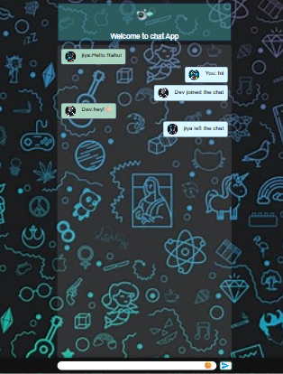

# 💬 Real-Time Chat Application

This is a responsive, real-time chat application built with **Socket.IO**, **HTML/CSS**, and **JavaScript**. It supports multiple users, avatars, emoji input, typing indicators, and auto-scroll — all wrapped in a clean UI optimized for both desktop and mobile.

---

## 🚀 Features

- 🔁 Real-time bi-directional messaging using Socket.IO
- 😀 Emoji picker with click-to-insert functionality
- ✍️ Typing indicator with animated dots (`User is typing...`)
- 📌 Fixed-position chat input with emoji toggle and send button
- ⬇️ Auto-scrolls to the latest message
- 👤 Random avatars assigned to each user
- 🔔 Notification sound on incoming messages
- 🧼 Hidden scrollbar for a cleaner look

---

## 🛠️ Tech Stack

- **Frontend:** HTML, CSS, JavaScript
- **Backend:** Node.js, Express, Socket.IO
- **Media:** Emoji Picker Web Component, Avatars, Audio

---

# 📁 Project Structure

- **nodeserver/**
  - `index.js`
  - `package.json`
  - `.gitignore`
  - `README.md`
  - **public/**
    - `index.html`
    - `ss.png` – 📸 Screenshot of folder structure ✅
    - **css/**
      - `style.css`
    - **js/**
      - `client.js`
    - **avatars/**
      - `image2.jpg`
      - `image4.png`
      - `image5.png`
      - `image6.jpeg`
      - `image7.jpeg`
    - `ting.mp3`
    - **emoji-picker/**
      - `emoji-picker.min.js`
     
---

## 💡 UI Highlights

- ✅ Input bar is **fixed at the bottom** of the chat window
- ✅ Emoji icon is **positioned inside the input field** (on the right)
- ✅ Messages are **aligned left or right** based on sender
- ✅ Typing animation is displayed and **auto-hides** after 2 seconds
- ✅ Smooth auto-scroll to the most recent message
- ✅ Fully responsive design — looks great on all devices

---
# 📸 Screenshots

